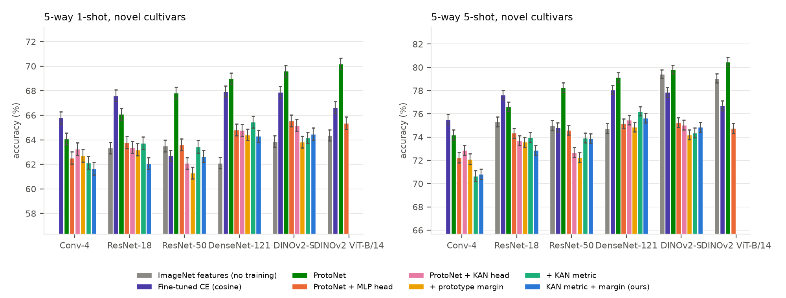

# MangoFS-BD: few-shot recognition of Bangladeshi mango cultivars

Code and results for a study of **few-shot recognition of unseen mango
cultivars**. Given only 1, 5 or 10 labelled photos of a cultivar the model has
never seen in training, how accurately can it recognise further photos of that
cultivar?

**Download the processed dataset:**
[MangoFS-BD.zip](https://github.com/rabeyanoor/mango-fewshot-bd/releases/download/v1.0/MangoFS-BD.zip)
(about 500 MB; [release page](https://github.com/rabeyanoor/mango-fewshot-bd/releases/tag/v1.0)).

The repository contains:

- **A benchmark.** Three public Bangladeshi mango datasets merged into one
  24-cultivar benchmark (11,613 images). Near-duplicate photos are grouped so
  that they can never leak between training and test.
- **A controlled comparison.** Prototypical Networks, cross-entropy transfer,
  ArcFace, SupCon and triplet losses on Conv-4, ResNet-18, ResNet-50,
  DenseNet-121 and DINOv2 backbones. Every model is scored on identical test
  episodes.
- **Kolmogorov–Arnold network (KAN) components.** A KAN projection head as an
  alternative to the MLP head, and a learnable KAN distance for Prototypical
  Networks.
- **Ordinary fine-tuning compared with few-shot inference** at matched numbers
  of labelled images.
- **All raw results** of the experiments (`results/`). Every table can be
  regenerated from these files without a GPU.

## Main findings

- **Unseen cultivars are much harder than the closed set.** On the 5-way
  unseen-cultivar task, the best model per backbone reaches 68–70% with 1 photo
  per cultivar and 78–81% with 5 photos. Ordinary fine-tuning reaches
  95.8–99.5% when every cultivar is known in advance.
- **Projection heads hurt transfer.** Adding an MLP or KAN head lowers
  accuracy on unseen cultivars. The best embedding is the backbone feature of a
  model that was trained with a head and is then used without it: 81–84% in
  5-shot tasks.
- **KAN does not help.** The KAN head is on par with the MLP head (−1.9 to
  +0.6 points) with about ten times as many parameters. The KAN metric helps
  only DenseNet-121 (about +1 point). This is reported as a negative result.
- **Changing the source dataset costs the most accuracy.** When support and
  query photos come from different source datasets (other phone, region,
  background, ripeness), 5-shot accuracy drops by 13–28 points. Centring the
  features on the unlabelled test photos of each source recovers up to 4.4
  points. Cultivars that appear in several source datasets are the hardest to
  recognise.
- **A larger backbone adds little.** DINOv2 ViT-B/14 is at most one point
  more accurate than ViT-S/14, with four times the parameters.
- **The differences are not seed noise.** Over three training seeds the
  accuracy varies by a standard deviation of at most 1 point, while the gaps
  between heads are 3–5 points.
- **Leakage inflates closed-set accuracy by only 0.9–2.6 points**, because
  closed-set accuracy is already near the ceiling.
- **With 5 or more images per cultivar of a known set, ordinary fine-tuning
  beats prototypes.** With a single image per cultivar, prototypes are as good
  or better.

<p align="center"></p>

<p align="center"><em>Accuracy on unseen cultivars (5-way, mean of three folds, 95% CI).</em></p>

More figures in [`figures/`](figures):
[confusion matrices](figures/fig_confusion.png),
[fine-tuning vs few-shot (DenseNet-121)](figures/fig_finetune_vs_fewshot_densenet121.png),
[fine-tuning vs few-shot (ResNet-18)](figures/fig_finetune_vs_fewshot_resnet18.png),
[learned KAN metric functions](figures/fig_kan_metric_paper.png),
[cultivars across source datasets](figures/fig_multisource.png).

## 1. Benchmark

No new images were collected. Three public datasets (CC BY 4.0) are merged:

| Source | Cultivars | Images | Notes |
|---|---|---|---|
| [MangoImageBD](https://data.mendeley.com/datasets/hp2cdckpdr/2) | 15 | 5,703 | original photos only (augmented copies excluded) |
| [MangoClassify-12](https://www.kaggle.com/datasets/researchersajid/mangoclassify-12-native-mango-dataset-from-bd) | 12 | 3,900 | 4 phone models, EXIF timestamps |
| [Mangifera2012](https://data.mendeley.com/datasets/w5jg84txj8) | 10 | 2,012 | iPhone 14 Pro Max, EXIF timestamps |
| **Merged** | **24** | **11,613** | cultivar names harmonised; one cross-label near-duplicate pair removed |

- **Preprocessing** (`src/preprocess.py`): trim padding bars, crop a square
  around the fruit (the most fruit-like saturated blob), resize to 288×288. A
  full-frame variant keeps the background for an ablation.
- **Capture groups** (`src/data.py: build_groups`): photos of the same fruit
  taken seconds apart (consecutive EXIF timestamps of one camera, at most 10 s
  apart), or near-identical images (DINOv2 cosine similarity ≥ 0.97), form one
  group. Support and query
  sets never share a group, and closed-set test splits hold out whole groups.
- **Metadata** (`benchmark/`): `meta.csv` lists every image with its source,
  original label, cultivar, camera and timestamp. `groups.csv` gives its
  capture group and whether it was dropped (`drop=1`).
- **Checks** (`tools/verify_benchmark.py`): image counts equal the published
  counts, every source folder maps to one cultivar, no group mixes cultivars,
  and the folds are cultivar-disjoint. The script also writes figures for
  inspecting the processing by eye.

### Download the processed benchmark

[`MangoFS-BD.zip`](https://github.com/rabeyanoor/mango-fewshot-bd/releases/download/v1.0/MangoFS-BD.zip)
(about 500 MB, attached to [release v1.0](https://github.com/rabeyanoor/mango-fewshot-bd/releases/tag/v1.0)) contains every processed image as a
288×288 JPEG, both as a fruit crop (`images/crop/`) and as a full frame
(`images/full/`), sorted into one folder per cultivar. It also has
`metadata.csv` with source, original label, capture group and `drop` flag, and
the exact splits of every protocol (`splits/*.json`). The archive holds 11,615
images; the 2 images with `drop == 1` are excluded from every split. The
experiments read the same images from uncompressed arrays, so JPEG
re-compression causes small pixel differences.

## 2. Evaluation protocols

| Protocol | What it measures |
|---|---|
| unified | 3-fold cultivar cross-validation: 16 training and 8 unseen cultivars per fold; 5-way 1/5/10-shot tasks, 600 episodes each |
| cross-domain | support photos from one source dataset, query photos of the same cultivars from another |
| open set | 5 known cultivars plus 1 unknown; AUROC of rejecting the unknown |
| leave one dataset out | train on two source datasets, test on the third |
| closed set | K ∈ {1, 5, 10, 20, all} images per cultivar: ordinary fine-tuning vs prototypes |
| leakage | random image split vs capture-group split |

Metrics: accuracy and macro-F1 with 95% confidence intervals, per-cultivar
recall, confusion matrices, calibration error, and Wilcoxon signed-rank tests
on identical episodes with Holm correction.

## 3. Methods

| Name in code | Description |
|---|---|
| `proto`, `proto_mlp`, `proto_kanhead` | Prototypical Network with no head, an MLP head or a KAN head |
| `kan_metric` | ProtoNet + MLP head with the KAN distance `d(q,c) = ‖q−c‖² + Σⱼ φⱼ(|qⱼ−cⱼ|)` |
| `proto_margin` | ProtoNet + MLP head with an additive prototype margin in the loss |
| `ours` (KAN-Proto) | KAN distance and prototype margin together |
| `ce`, `arcface`, `supcon`, `triplet`, `proto_tri` | cross-entropy (cosine classifier), ArcFace, supervised contrastive, triplet (random / semi-hard / batch-hard / distance-weighted mining), ProtoNet + triplet |
| `imagenet` | pretrained features without any training on mango images |
| per-episode fine-tuning | a pretrained network fine-tuned on the support set of each test episode |

Backbones: Conv-4 (trained from scratch), ResNet-18, ResNet-50, DenseNet-121,
DINOv2 ViT-S/14 and ViT-B/14.

Test-time rules: nearest prototype on the head output `z`, on the backbone
feature `f`, on `f` with CL2N, on `f` centred per source dataset
(transductive), and logistic regression on `z`.

## 4. Repository layout

```
src/                library; copied unchanged into every Kaggle kernel
  prep_data.py        download the three datasets, harmonise labels, build the image cache
  preprocess.py       padding trim, fruit crop, perceptual hash
  data.py             image cache, capture groups, folds and protocol splits, samplers, augmentation
  models.py           backbones, MLP and KAN heads, KAN metric
  losses.py           all training objectives
  train.py            train one configuration and evaluate it
  evaluate.py         episodic evaluation, open set, metrics
  finetune.py         per-episode and closed-set fine-tuning
  efficiency.py       parameters, GMACs, latency
  export.py           package the benchmark as a zip archive
  run.py              experiment suites; resumable driver over 2 GPUs
tools/
  build_groups.py     build capture groups from metadata and DINOv2 embeddings
  verify_benchmark.py independent checks of the benchmark
analysis/
  aggregate.py        result files -> results/tables.md and figures
  kan_curves.py       plot the learned KAN metric functions of a checkpoint
benchmark/          meta.csv (every image) and groups.csv (capture groups)
notebooks/          MangoFS_BD.ipynb: the library and pipeline as one Kaggle notebook
figures/            main result figures
results/
  kaggle/<suite>/     raw results of each suite, one JSON line per trained model
  tables.md           all result tables
logs/               Kaggle run log of the data preparation and of every experiment suite
tests/              unit tests
```

## 5. Reproduce

All training ran on free Kaggle notebooks (2× T4 GPU). Locally you only need
a CPU to run the tests and regenerate the tables:

```bash
python -m venv .venv && .venv/bin/pip install -r requirements.txt
.venv/bin/python -m pytest -q tests/test_units.py      # unit tests
.venv/bin/python analysis/aggregate.py                 # results/kaggle -> results/tables.md
```

To re-run the experiments:

1. **Image cache.** In a Kaggle CPU notebook with internet on and the
   MangoClassify-12 dataset attached, run `import prep_data; prep_data.main()`
   (with `src/` on the path). It downloads the two Mendeley datasets and writes
   `crop.npy`, `full.npy` and `meta.csv`.
2. **Capture groups.** Upload `benchmark/groups.csv` as a Kaggle dataset, or
   rebuild it: the suite `groups` computes DINOv2 embeddings and
   `tools/build_groups.py <meta.csv> <feats.npy> <out_dir>` builds the groups.
3. **Experiments.** Open `notebooks/MangoFS_BD.ipynb` on Kaggle, add the
   image cache and `groups.csv` as inputs, and turn on GPU T4 ×2 and internet.
   In section 5, set `SUITE` to one of the suites below, uncomment
   `run.main(SUITE)` and run the notebook.
   The suites `closed_set` and `improve` reuse saved models, so add the
   outputs of `lodo_main` (and of `unified_main` for `improve`) as inputs too.

| Suite | What it runs |
|---|---|
| `unified_main` | main grid: every method and backbone on the 3 cultivar folds |
| `lodo_main` | leave one dataset out |
| `unified_extra` | training objectives and triplet mining policies |
| `closed_set` | closed set: fine-tuning vs prototypes, leakage test |
| `episode_ft` | per-episode fine-tuning |
| `efficiency` | parameters and latency |
| `ablations` | seeds and full-frame images |
| `improve` | backbone-feature and source-centred rules on saved models; DINOv2 ViT-B/14 |

Each suite writes one JSON line per trained model to
`results_<suite>_<gpu>.jsonl`. Copy these files to `results/kaggle/<suite>/`
and run `analysis/aggregate.py`. Suites are resumable: if the notebook hits
the time limit, run it again with its previous output added as input and
finished configurations are skipped. Episode seeds depend only on (protocol,
fold, K), so every model is scored on the same episodes.

Other scripts:

```bash
.venv/bin/python tools/verify_benchmark.py <benchmark_dir> <out_dir>   # benchmark checks and inspection figures
.venv/bin/python analysis/kan_curves.py <ckpt.pt>...                   # plot the learned KAN functions
```

`<benchmark_dir>` is a folder holding `crop.npy`, `full.npy`, `meta.csv` and
`groups.csv` (the output of step 1 plus `groups.csv`). Checkpoints are saved
by the suites on Kaggle and are not stored in this repository.

## 6. Licence and data

Code: MIT licence (see `LICENSE`). The processed images in the release are
derived from MangoImageBD, MangoClassify-12 and Mangifera2012, which are
licensed CC BY 4.0, and are redistributed under the same licence. Please cite
the three source datasets when you use the benchmark.
